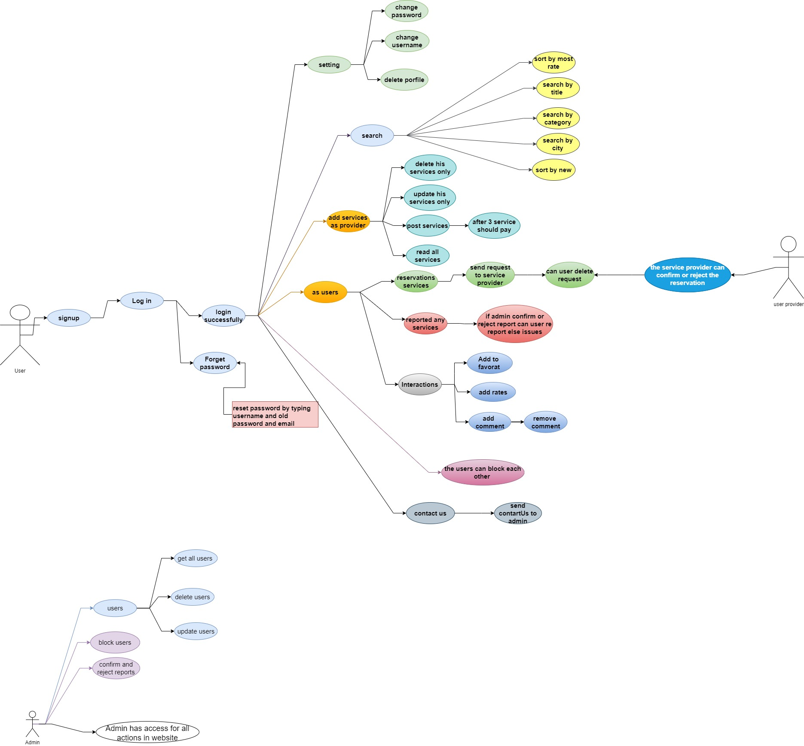

# Hi-service

 ## Authorization
* users - READ

* users can create a service or company 
* admin - READ/CREATE/UPDATE/DELETE

## User Stories

* we prepare user stories

## Domain Modeling

* we create simple model for our app that show the relationships between the functions/methods and entities
 

* the last model for app it is now look like 

## Using a Database? Make an Database Schema Diagram

* we prepare our database and tables as shown in the pic

* we created 3 tables , as start
  * main table for the users , it will contain username , password , role , Email, and  it will have relation to other all table

  * 2nd table will be for the services , we will save all type of services in this table , nameProfession , image , description, city or location , phone number , userId
    * it will be **many services to one user**

  * 3rd table will be interactions , we will save comments , rates and add to Favorite for each service

  * we have relation and connection between interaction , the user table and service table

  * the last form fo our database and table look very cool 

  
