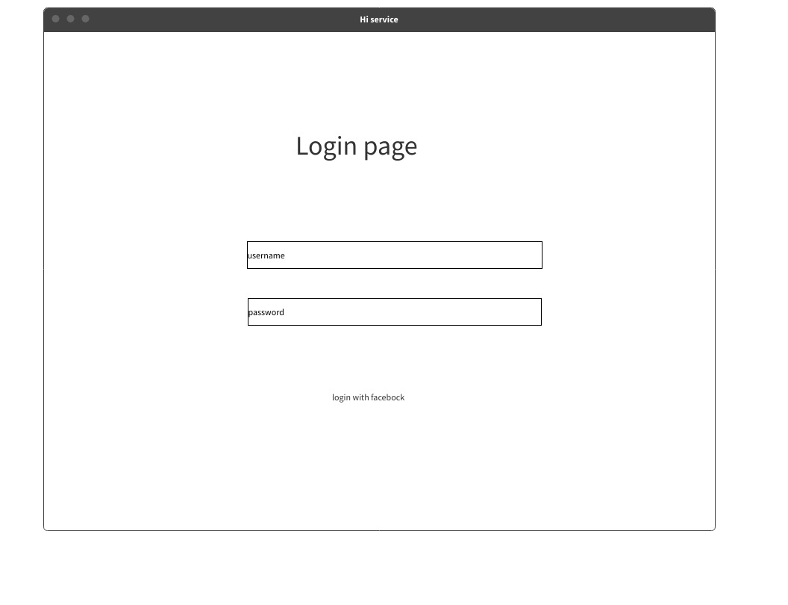
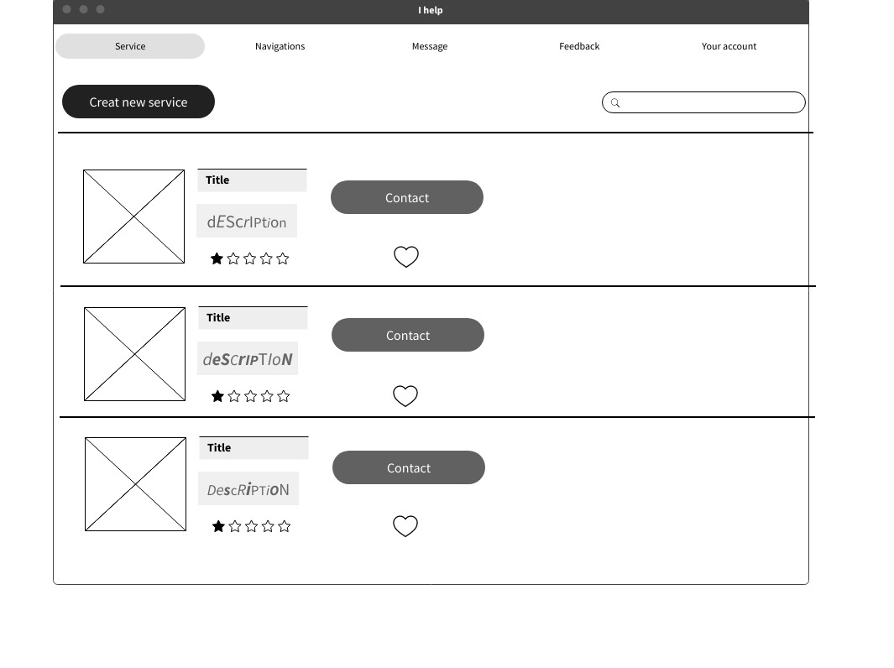
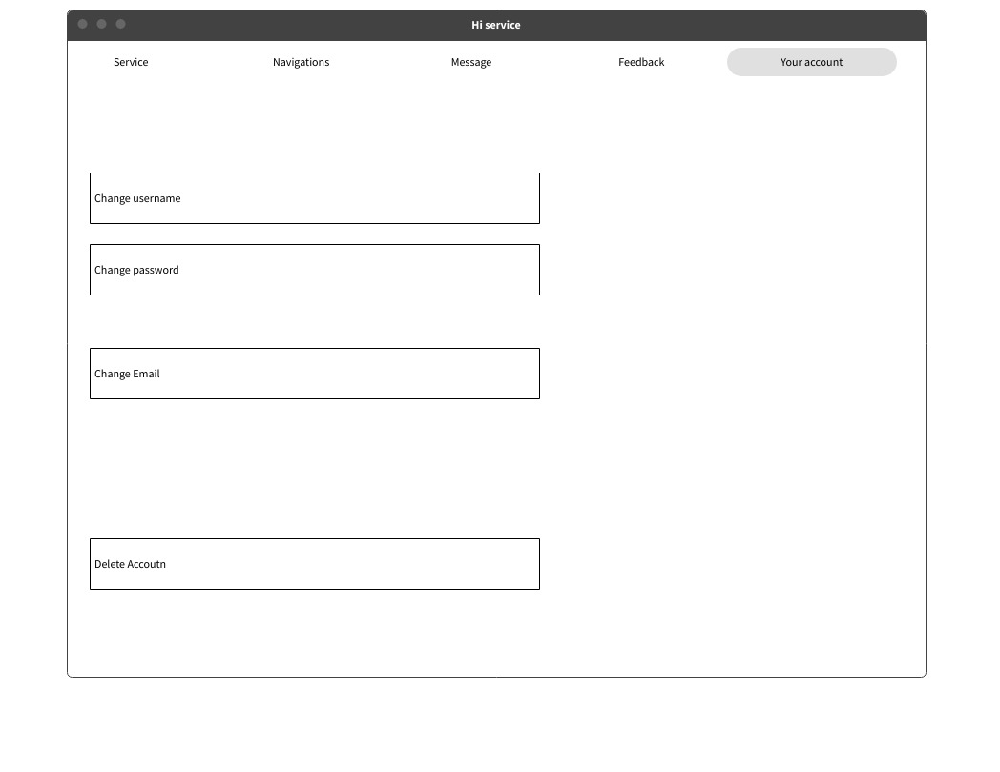
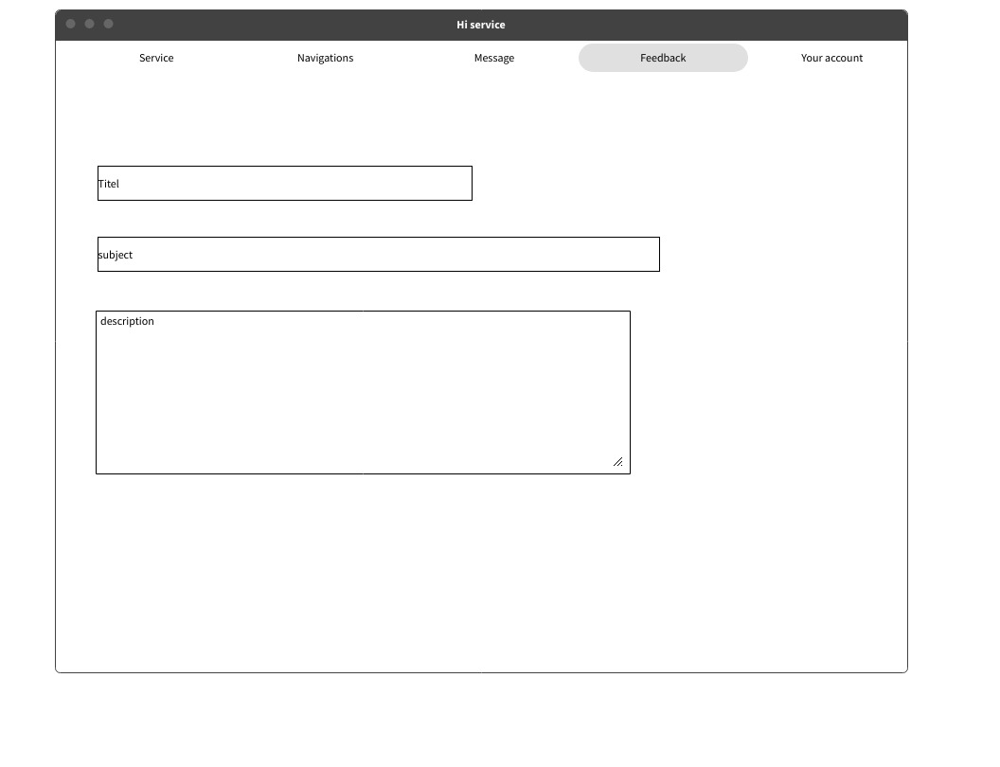
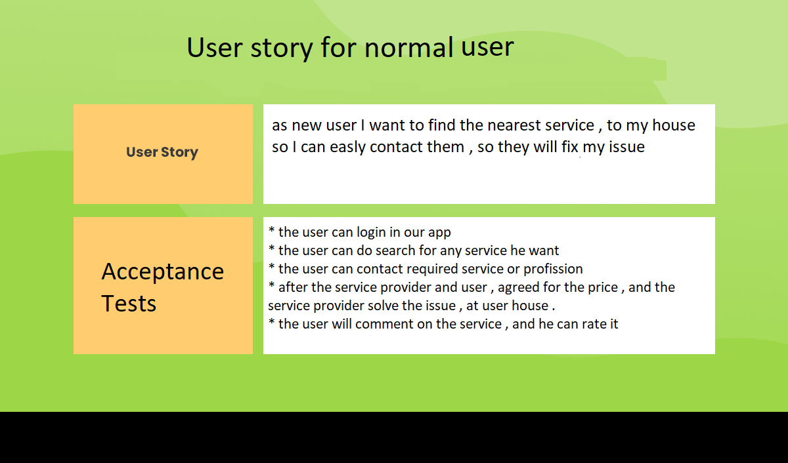
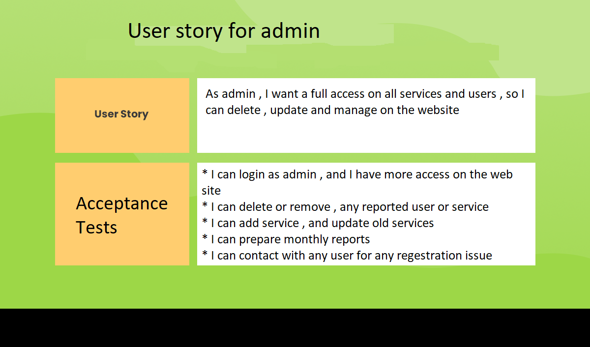
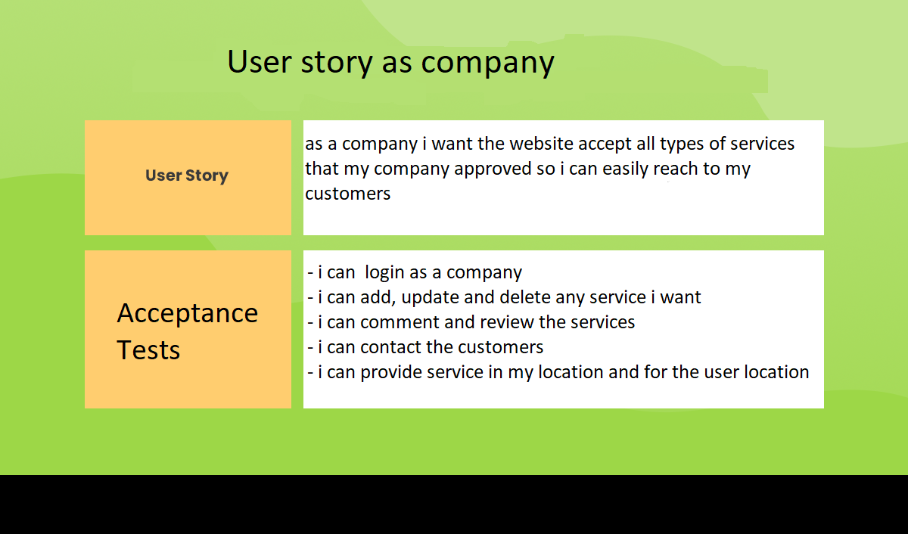
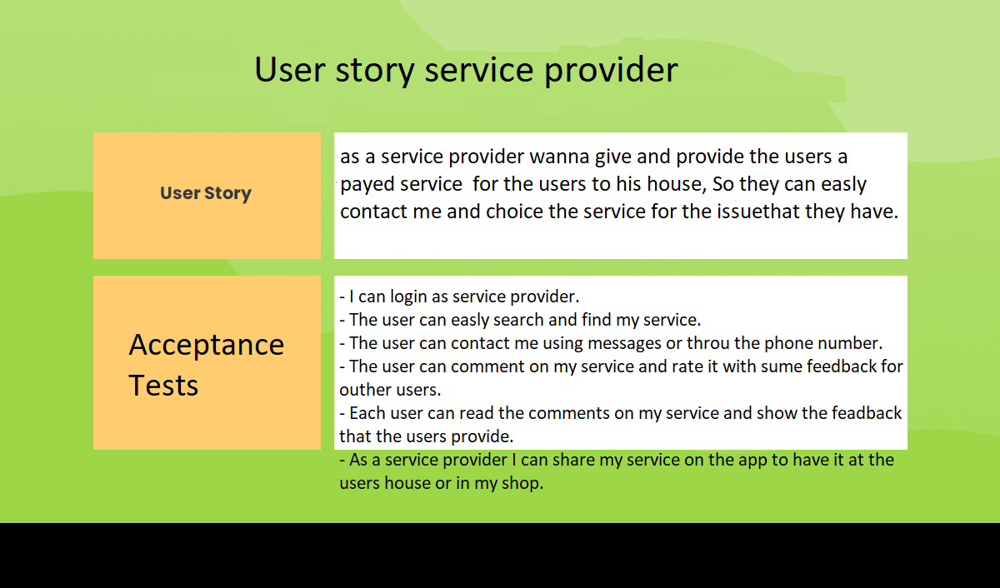
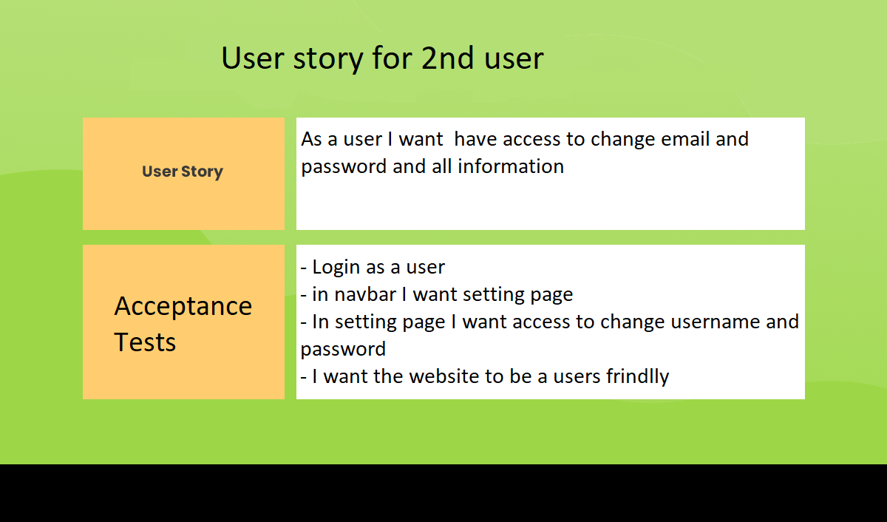

# Hi-service
## Begin Wireframes
* we prepare simple wirefram for our app , from the main page untile the user settings , all shown below 

.png)

.png)

.png)

## User Stories
* we prepare user stories 

## Domain Modeling
 
 * we create simple model for our app that show the relationships between the functions/methods and entities 
 

## Using a Database? Make an Database Schema Diagram

* we prepare our database and tables as shown in the pic 

* we created 4 tables , as start
    * main table for the users , it will contain username , password , role , Email, and  it will have realtion to other all table 

    * 2nd table will be for the services , we will save all type of services in this table , nameProfession , image , description, city or location , phone number , userId 
        * it will be **many services to one user**

    * 3rd table will be interactions , we will save comments , rates and add to Favorite for each 

    * we have relation and connection between interaction , the user table and service table 

    

    

